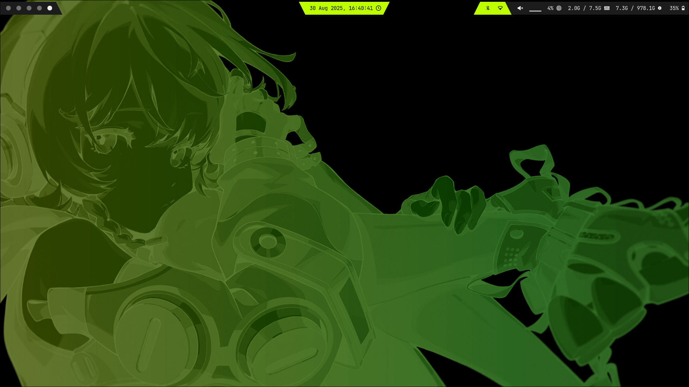
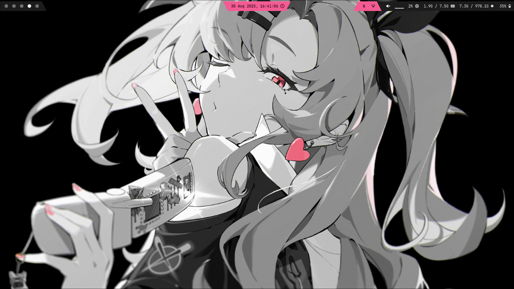
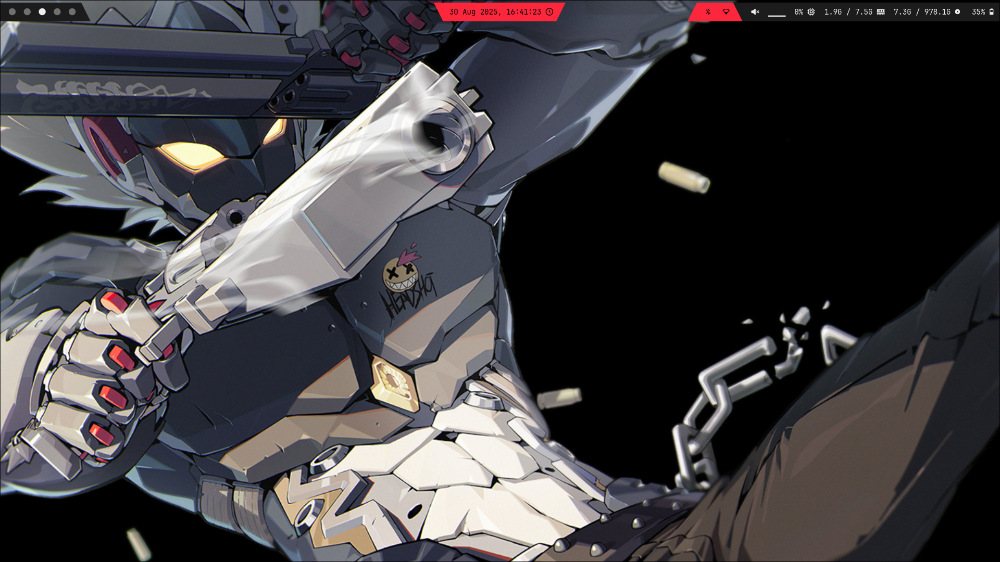
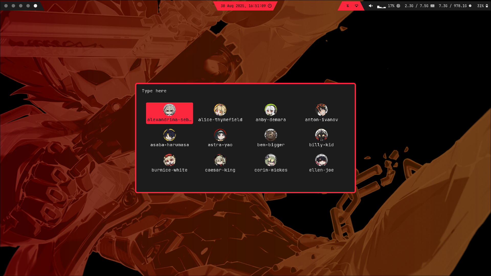
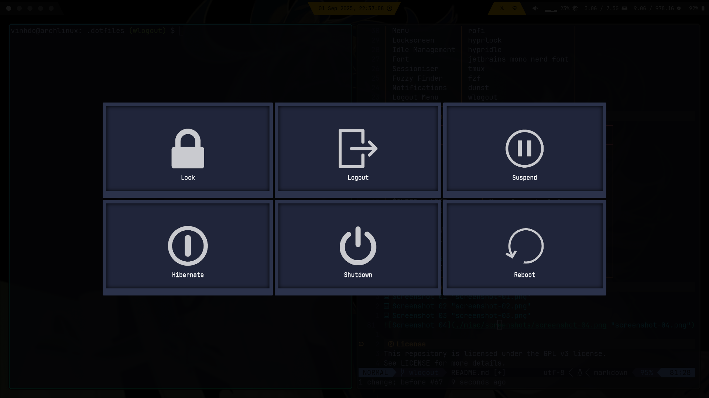

# Zenless Zone Zero Dotfiles for Hyprland
A custom-made environment based on the theme of Zenless Zone Zero.

These dotfiles are highly customisable, designed to give you full control
for your setup.

All themes are based on Agents in Zenless Zone Zero.

> [!NOTE]
> This configuration only works, if you're on an [ArchLinux](https://archlinux.org/).

## Features
* Fast theme switcher to switch themes.
* Productive and efficient TMUX sessioniser to switch projects.
* Custom Neovim configuration as an IDE.
* Custom themes for users to modify,
* Screenshot feature to capture the entire monitor.

## Getting Started
### Installation
1. Clone the repository.
```sh
git clone https://github.com/VinhTDo/dotfiles.git ~/.dotfiles
```
2. Change directory to ~/.dotfiles.
```sh
cd ~/.dotfiles
```
3. Grant permission from install.sh as executable.
```sh
chmod +x install.sh
```
4. Run install.sh
```sh
./install.sh
```
5. Grant permissions for each scripts in ~/.config/scripts as executable.
```sh
chmod +x <script-file>
```

## Dependencies
| App | Package |
| -------------- | --------------- |
| Windows Manager | hyprland |
| Shell | bash *(default on Linux)* |
| Editor | neovim |
| Terminal | ghostty |
| Status Bar | waybar |
| Wallpaper | hyprpaper |
| Screenshot | hyprshot |
| Menu | rofi |
| Lockscreen | hyprlock |
| Idle Management | hypridle |
| Font | jetbrains mono nerd font |
| Sessioniser | tmux |
| Fuzzy Finder | fzf |
| Notifications | dunst |
| Logout Menu | wlogout |

## Keybindings
| Keymap | Description |
| -------------- | --------------- |
| $SUPER + Q | Open terminal |
| $SUPER + C | Close active window |
| $SUPER + M | Exit Hyprland |
| $SUPER + R | Open menu |
| $SUPER + V | Toggle floating window |
| $SUPER + LEFT | Move focus to left |
| $SUPER + RIGHT | Move focus to right |
| $SUPER + UP | Move focus to up |
| $SUPER + DOWN | Move focus to down |
| $SUPER + SHIFT + T | Open theme selector |
| PRINT | Screenshot output |
| $SUPER + [1-5] | Switch to workspace 1-5 |
| $SUPER + SHIFT + [1-5] | Move active to workspace 1-5 |
| $SUPER + ESCAPE | Open wlogout |

## Screenshots






## License
This repository is licensed under the GPL v3 license.
See LICENSE for more details.
